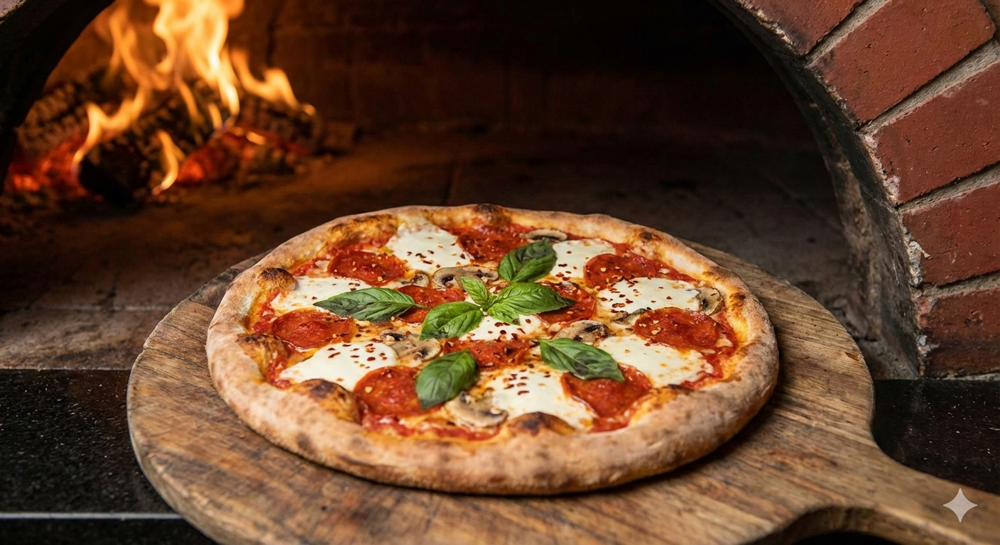
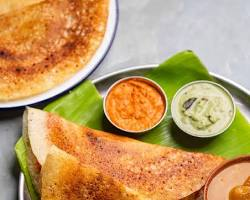
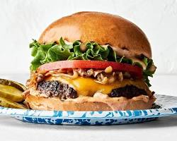

# 🍽️ FoodLand — React Food Recipes Landing Page

<marquee behavior="scroll" direction="left" scrollamount="6">
🚀 Built on real demand • Guided by feedback • Structured with React • Deployed on Vercel
</marquee>

## 📌 Project Overview

**FoodLand** is a responsive food recipes landing page built using **React.js (Create React App)**.  
This project was developed **based on real-time requirements and continuous feedback**, simulating a real-world frontend development workflow rather than a tutorial-based build.

---

## 🧠 Background Story

The idea for FoodLand started from a simple requirement discussion with my learning mate **Srivalli Yaarlagadda**.

I asked her about her favorite food items.  
She listed them.  
Those exact items became the foundation of this application.

Initially, the project was attempted using plain HTML, CSS, and JavaScript. However, repeated UI feedback revealed issues such as:
- Inconsistent card layouts  
- Image size mismatches  
- Overuse of visual effects instead of fixing structure  

Based on continuous guidance and honest feedback, the project was rebuilt using **React**, focusing on layout discipline, component reusability, and scalability.

This shift marked the real learning phase of the project.

---

## 🛠️ Tech Stack (Clickable Stickers)

---

## ✨ Features

✔ Responsive layout  
✔ Component-based React architecture  
✔ Recipe cards with image, name, description, and price  
✔ Clean and scalable folder structure  
✔ Custom CSS (no UI libraries)  
✔ Production-ready deployment  

---

## 🧩 Project Structure

food-recipes-landing-page/
│
├── public/
│ └── index.html
│
├── src/
│ ├── assets/
│ │ └── images/
│ ├── components/
│ │ ├── Navbar.js
│ │ ├── Hero.js
│ │ ├── RecipeCard.js
│ │ └── RecipeGrid.js
│ ├── data/
│ │ └── recipes.js
│ ├── styles/
│ │ ├── Navbar.css
│ │ ├── Hero.css
│ │ ├── RecipeCard.css
│ │ └── RecipeGrid.css
│ ├── App.js
│ ├── index.js
│ └── index.css
│
├── package.json
└── README.md

---

## 🖼️ Sample Preview

  
  
  
  

---

## 🎨 UI & Styling Philosophy

- Layout-first approach  
- Consistent card dimensions  
- Predictable grid behavior  
- Minimal effects, maximum clarity  

> **Key learning:**  
> Good UI is built with structure, not animations.

---

## 🔮 Future Enhancements

- Search and filter functionality  
- Category-based recipe sections  
- Backend integration  
- User authentication & favorites  
- Animations and micro-interactions  
- Migration to Next.js  

---

## 🙏 Acknowledgment

Special thanks to **Srivalli Yaarlagadda** for providing real requirements, honest feedback, and continuous guidance throughout the development process.

This project reflects a core principle:
> **Build on demand. Improve through feedback.**

<b>Built with discipline • Improved through feedback • Ready to scale</b>

